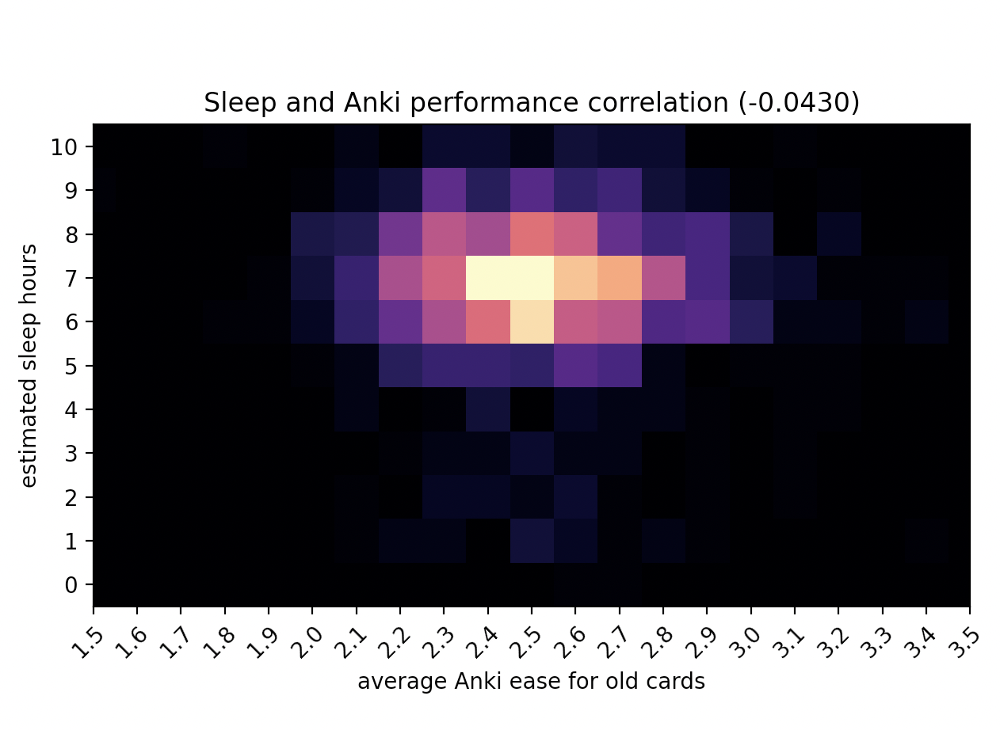

# Sleep and Anki performance

This repo implements a rough calculation of the correlation between sleep hours and daily Anki review performance.

Sleep is estimated using Google activities (assuming that the clock app is the last and first to be used when sleeping).

Anki card reviews performance are calculated using the complete revlog.

The result are two heatmaps and a Pearson coefficient. In my case, no correlation exists between the two metrics.




## How to run

You will have to adapt the scripts to parse the Google Activity file in your language anbd timezone, and maybe adapt to your sleep habits. Currently it assumes one sleeps only at night and never outside 21-9 in local time

The instructions below are for macOS/Linux and require Python 3. On Windows it should work but the first 3 commands will be different. Check the virtualenv documentation about it.

```bash
# create the virtualenv
python3 -m venv .venv
# activate it
source .venv/bin/activate
# install the requirements
python3 -m pip install -r requirements.txt
# read Google takeout HTML export and creates activities.jsonl
python3 activities_takeout_to_json.py
# shows a the day of the week/hour activities heatmap, can be skipped
python3 activities_weekly_heatmap.py
# reads Anki's collection.anki2 SQLLite file and creates anki_daily_performance.jsonl
python3 anki_daily_performance.py
# calculate correlation between sleep and Anki results, and show it
python3 anki_sleep_correlation.py
```
